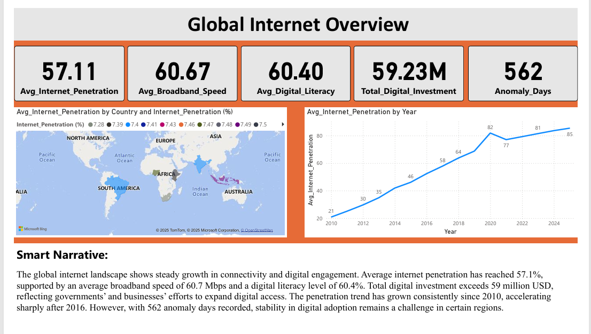
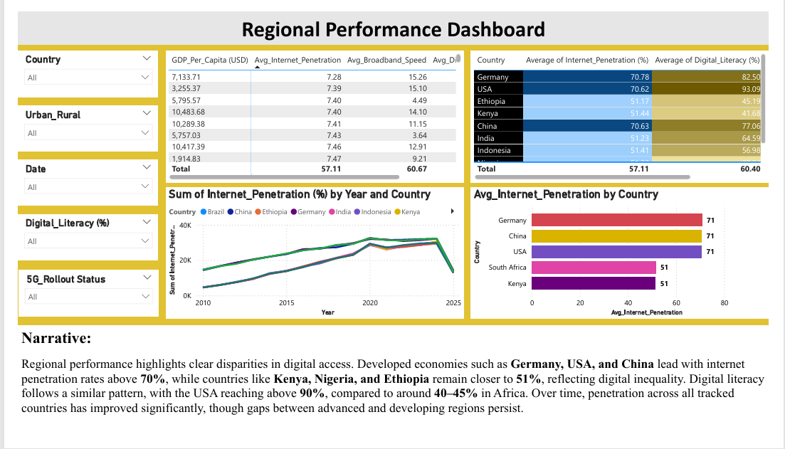
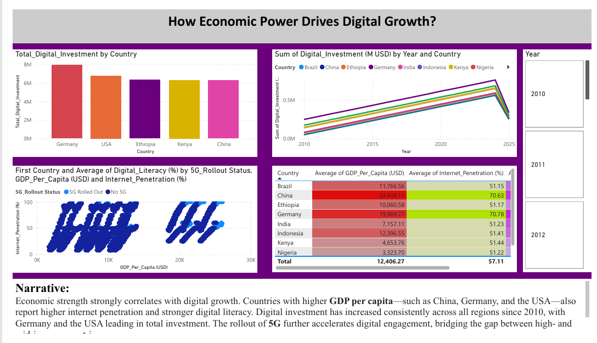
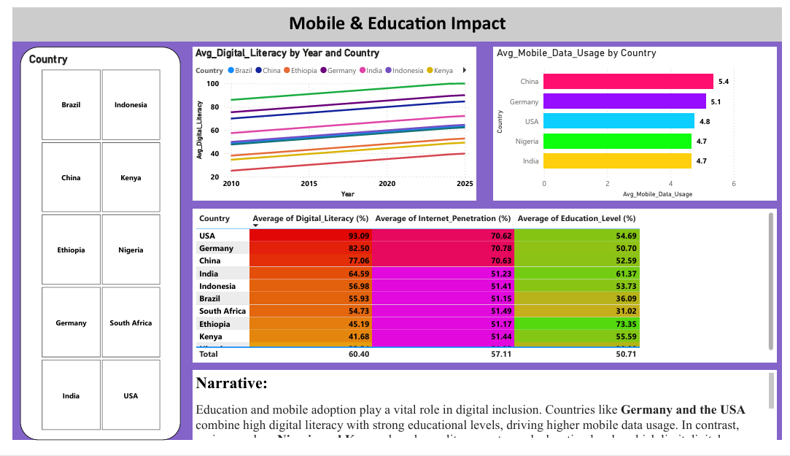
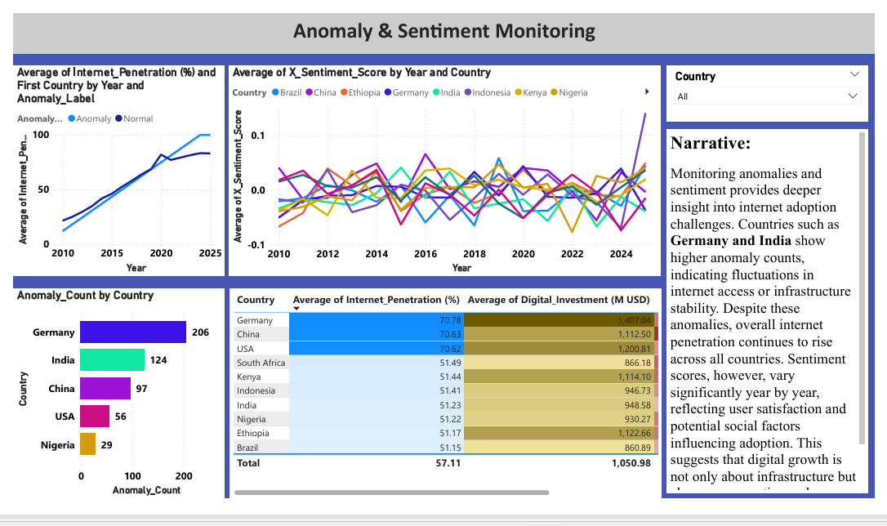

# 🌐 Global Internet Adoption Analytics Dashboard  

📊 **Power BI Project | Data Analytics | Data Visualization**  

This project explores **global internet adoption trends (2010–2025)** using a large-scale dataset.  
The interactive **Power BI dashboard** provides insights into **internet penetration, digital literacy, broadband speed, GDP per capita correlations, anomaly detection, and investment patterns** across multiple regions.  

---

## 📂 Project Files
- `global_internet_adoption_daily_2010_2025_with_clusters.csv` → Dataset used for analysis  
- `New Global Internet Adoption Dashboard.pbix` → Power BI dashboard file  
- `New Global Internet Adoption Dashboard.pdf` → Exported PDF version for quick view  

---

## 🔍 Key Insights
- 🌍 **Global Overview:** Internet penetration has grown steadily since 2010, accelerating after 2016.  
- 📈 **Economic Impact:** Countries with higher GDP per capita (USA, China, Germany) show stronger adoption and digital literacy.  
- ⚡ **5G Rollout:** Regions with 5G rollout display significantly higher broadband speed and internet engagement.  
- 🏆 **Regional Comparison:** Developed nations show ~70% penetration vs. ~50% in developing regions, highlighting digital inequality.  
- 🚨 **Anomaly Detection:** 562 anomaly days recorded, showing instability in infrastructure in some regions.  

---

## 🛠️ Tools & Technologies
- **Power BI** → Interactive dashboards, DAX, Smart Narrative  
- **SQL / Data Cleaning** → Pre-processing before dashboarding  
- **Excel / CSV** → Raw dataset preparation  
- **Python (EDA)** → Optional preprocessing and clustering support  

---

## 📸 Dashboard Preview

---

## 🚀 How to Use
1. Download the `.pbix` file → Open with Power BI Desktop.  
2. Explore filters (Country, GDP, 5G rollout, etc.).  
3. Refer to PDF for static preview if you don’t have Power BI installed.  

---

## ✨ Project Outcome
This project demonstrates **how data visualization can uncover insights about digital growth, inequality, and technology adoption**.  
It highlights the importance of **interactive dashboards** for storytelling in data analytics.  

---
👨‍💻 *Developed by [Pushkar Dhond](https://www.linkedin.com/in/pushkardhond/)*  

